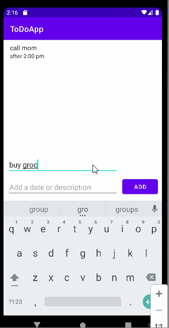

# Pre-Work - *ToDo App*

**ToDo App** is an android app that allows building a todo list and basic todo items management functionality including adding new items, editing and deleting an existing item.

Submitted by: **Yiyi Huang**

Time spent: **4** hours spent in total

## User Stories

The following **required** functionality is completed:

* [x] User can **view a list of todo items**
* [x] User can **successfully add and remove items** from the todo list
* [x] User's **list of items persisted** upon modification and and retrieved properly on app restart

The following **additional** features are implemented:

* [x] User can **add a date or description to the todo item**

## Video Walkthrough

Here's a walkthrough of implemented user stories:

GIF created with [LiceCap](http://www.cockos.com/licecap/).

## Notes

I ran into an obstacle while implementing the description/date feature. I had originally planned to make a two dimensional list to store each item as a pair of the info for task and description. However, the method used to read from the data files was the readLine method that enters every line of the file as an element into a list. This would mean that I could only use lists of string. To resolve this, I made two separate files for task and description as well as separate lists to store the information. The description for the i-th task in the task list would be in the i-th position of the descriptions list.

## License

    Copyright 2022 Yiyi Huang

    Licensed under the Apache License, Version 2.0 (the "License");
    you may not use this file except in compliance with the License.
    You may obtain a copy of the License at

        http://www.apache.org/licenses/LICENSE-2.0

    Unless required by applicable law or agreed to in writing, software
    distributed under the License is distributed on an "AS IS" BASIS,
    WITHOUT WARRANTIES OR CONDITIONS OF ANY KIND, either express or implied.
    See the License for the specific language governing permissions and
    limitations under the License.
